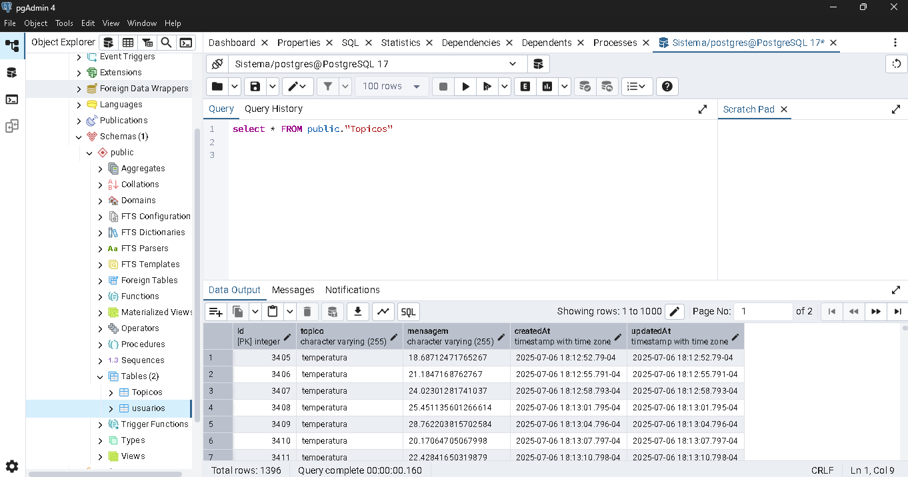

# Servidor_digitalTwins
 
# 🚀 Guia de Configuração do Servidor Node.js com Dashboard MQTT

Este guia descreve o passo a passo para configurar, rodar e acessar o servidor Node.js responsável pela coleta de dados de sensores e controle remoto via dashboard web.

---

## 📁 Estrutura de Pastas

```
supervisorio_mqtt_dashboard/
├── config/
│   └── sequelize.js
├── models/
│   └── topico.js
├── public/
│   ├── css/
│   │   └── style.css
│   └── js/
│       └── dashboard.js
├── routes/
│   └── api.js
├── views/
│   ├── layouts/
│   │   └── main.handlebars
│   └── index.handlebars
├── index.js
└── package.json
```
## 🛠 Requisitos

- Node.js instalado (https://nodejs.org)
- Acesso à internet para instalar pacotes
---
## 📦 Instalação dos Pacotes

No terminal, dentro da pasta do projeto, execute:

```bash
npm install express express-handlebars body-parser mqtt sequelize sqlite3
```
---
## 🔗 Configuração do Banco de Dados

- Por padrão, o sistema utiliza **Postgre** local.
- O arquivo do banco será gerado automaticamente: `mqtt_db.sqlite`

Se desejar usar outro banco (MySQL, SQLSERVER), edite `config/sequelize.js`.
- 
---
## 🚀 Iniciar o Servidor

```bash
node index.js
```
- Acesse no navegador:
```
http://localhost:3008/dashboard
```
Ou via IP local para acesso remoto:
```
http://192.168.X.X:3008/dashboard
```
---
## 🌐 Dashboard Web

- O dashboard permite visualizar dados de sensores de **temperatura** e **corrente** em tempo real.
- Controle remoto pode ser adicionado através de botões ou comandos MQTT.
- 
  

---

## 📡 Conexão com MQTT

- O servidor se conecta automaticamente ao broker MQTT configurado em:

```
index.js ➔ mqtt.connect('mqtt://localhost')
```

Altere conforme necessário para o endereço do seu broker.


## 📢 Observações

- Certifique-se de que o broker MQTT está ativo na rede.
- Sensores devem estar enviando dados MQTT corretamente.
- Porta 3008 deve estar liberada para acesso remoto na sua rede.
---
# 📶 Guia: Conexão Wi-Fi Automática com ESP32 (MicroPython)

Este código permite que o **ESP32** se conecte automaticamente à sua rede Wi-Fi durante o boot, utilizando MicroPython.
---
# 🚀 Instalação Rápida do MicroPython no ESP32

1️⃣ Baixe o firmware oficial:
👉 [https://micropython.org/download/esp32/](https://micropython.org/download/esp32/)
abaixo segue o arquivo de instalação

---

## 🔌 Arquivo: `boot.py`

Este arquivo deve ser salvo como `boot.py` no ESP32 para ser executado automaticamente sempre que o dispositivo for reiniciado.

---

## 📜 Código Completo

```python
# boot.py -- executado na inicialização
import network, utime, machine

# Substitua pelos dados da sua rede Wi-Fi
SSID = "NOMEDOSEUWIFI"
SSID_PASSWORD = "SENHA"

def do_connect():
    sta_if = network.WLAN(network.STA_IF)
    if not sta_if.isconnected():
        print('Conectando-se à rede Wi-Fi...')
        sta_if.active(True)
        sta_if.connect(SSID, SSID_PASSWORD)
        while not sta_if.isconnected():
            print("Tentando conectar...")
            utime.sleep(1)
    print('✅ Conectado! Configuração de rede:', sta_if.ifconfig())

print("Iniciando conexão Wi-Fi...")
do_connect()
```

---

## ⚙️ Como Usar

1. Abra o **Thonny**, **uPyCraft** ou outro editor compatível com MicroPython.
2. Copie este código e envie para o ESP32 com o nome `boot.py`.
3. Reinicie o ESP32.
4. O dispositivo tentará se conectar automaticamente à rede Wi-Fi especificada.
---
---
# 📡 Código MicroPython: Leitura DHT22 e Publicação MQTT (ESP32)

Este código em **MicroPython** permite ler temperatura e umidade usando o sensor **DHT22** conectado ao **pino 23** do ESP32 e publicar os dados via **MQTT**.
---
## 📜 Código Completo

# 📡 Código MicroPython: Leitura DHT22 e Publicação MQTT (ESP32)

Este código em **MicroPython** permite ler temperatura e umidade usando o sensor **DHT22** conectado ao **pino 23** do ESP32 e publicar os dados via **MQTT**.

---

## 🔌 Conexões

| DHT22 | ESP32 WROOM |
|-------|--------------|
| VCC   | 3V3          |
| GND   | GND          |
| DATA  | GPIO 23      |

---

## 📜 Código Completo

```python
import time
import machine
from umqtt.simple import MQTTClient
import random
from machine import Pin
from time import sleep
import dht
import math

sensor = dht.DHT22(Pin(23))

SERVER = "10.31.2.66"
PORT = 1883
CLIENT_ID = "teste"
TOPIC = "temperatura"

mqttClient = MQTTClient(CLIENT_ID, SERVER, PORT, keepalive=60)
mqttClient.connect()
print(f"Connected to MQTT Broker :: {SERVER}")

while True:
    try:
        sleep(2)
        sensor.measure()
        temp = sensor.temperature()
        hum = sensor.humidity()
        temp_f = temp * (9/5) + 32.0
        print('Temperature: %3.1f C' % temp)
        print('Temperature: %3.1f F' % temp_f)
        print('Humidity: %3.1f %%' % hum)

        mqttClient.publish(TOPIC, str(temp).encode())
        time.sleep(3)

    except OSError as e:
        print('Failed to read sensor.')
```
# ⚡ Leitura de Corrente AC com ESP32 e Sensor SCT-013 (MicroPython)

Este código em **MicroPython** permite ler corrente alternada utilizando o **ESP32** e um sensor de corrente não invasivo, como o **SCT-013**.

---

## 🔌 Conexões

| Sensor (SCT-013) | ESP32 WROOM |
|------------------|-------------|
| Sinal (via divisor resistivo) | GPIO 34 (ADC1) |
| GND              | GND         |
| VCC (se aplicável) | 3V3        |

> ⚠ Recomenda-se utilizar um divisor resistivo adequado para garantir que o sinal fique dentro do limite de tensão do ADC.

---

## 📜 Código Completo

```python
from machine import ADC, Pin
import time
import math

# Configurações
ADC_PIN = 34
NUM_SAMPLES = 1000
VREF = 3.3
ADC_RESOLUTION = 4095
SENSOR_SENSITIVITY = 100.0  # mV/A (ajustável)

adc = ADC(Pin(ADC_PIN))
adc.atten(ADC.ATTN_11DB)
adc.width(ADC.WIDTH_12BIT)

def read_current():
    readings = []
    for _ in range(NUM_SAMPLES):
        reading = adc.read()
        readings.append(reading)
        time.sleep_us(200)  # Amostragem rápida

    avg = sum(readings) / NUM_SAMPLES
    sq_diff = [(val - avg)**2 for val in readings]
    mean_sq = sum(sq_diff) / NUM_SAMPLES
    rms = math.sqrt(mean_sq)

    voltage = (rms / ADC_RESOLUTION) * VREF
    current = (voltage * 1000) / SENSOR_SENSITIVITY
    return current

while True:
    corrente = read_current()
    print("Corrente RMS: {:.2f} A".format(corrente))
    time.sleep(1)
```

## 📥Criando o servidor Broker - Instalação do Mosquitto
     Esse servidor será responsavél em receber as publicações realizadas pelos dispositivos esp32.
### 🔧 Em Windows:

1. Baixe o instalador: [https://mosquitto.org/download/](https://mosquitto.org/download/)
2. Execute o instalador e conclua a instalação.
3. Por padrão, o Mosquitto será instalado em:
```
C:\Program Files\mosquitto
```

### 🔧 Em Linux (Ubuntu/Debian):
```bash
sudo apt update
sudo apt install mosquitto mosquitto-clients
```


---

## ⚙️ Configuração Básica

1. Crie ou edite o arquivo de configuração `mosquitto.conf`.

### Exemplo Simples (`mosquitto.conf`):
Adicione essas 3 linhas de códigos no final do arquivo `mosquitto.conf`
```
listener 1883
allow_anonymous true
bind_address 0.0.0.0
```

2. No Linux:
```bash
sudo systemctl enable mosquitto
sudo systemctl start mosquitto
```

3. No Windows:
- Execute `mosquitto.exe` ou registre como serviço.

---
## 📥 Instalação do MQTTX

### 🔗 Download:
- Acesse o site oficial: [https://mqttx.app](https://mqttx.app)

### 💾 Windows:
1. Baixe o instalador `.exe` ou `.zip`.
2. Execute e instale normalmente.

### 🍏 macOS:
1. Baixe o instalador `.dmg`.
2. Arraste o ícone para a pasta **Aplicativos**.

### 🐧 Linux:
1. Baixe o arquivo `.AppImage` ou use:
```bash
snap install mqttx
```


---

## 🚀 Primeiros Passos no MQTTX

1️⃣ Clique em **+ Nova Conexão**.

2️⃣ Preencha as informações:

| Campo             | Exemplo                          |
|-------------------|------------------------------------|
| Nome              | Broker Mosquitto Local            |
| Host              | 127.0.0.1 ou IP do servidor MQTT  |
| Porta             | 1883                              |
| Protocolo         | MQTT                              |
| Username (opcional) | usuario_mqtt                    |
| Password (opcional) | senha_mqtt                      |

3️⃣ Clique em **Conectar**.


---

## 📡 Publicar Mensagens

1. Escolha a conexão ativa.
2. Clique em **Publicar**.
3. Insira o tópico e a mensagem.
4. Clique em **Enviar**.

Exemplo:
- Tópico: `sensores/temperatura`
- Mensagem: `25.3`

---
---

## 📌 Observações

- Verifique se o broker MQTT está ativo no IP `0.0.0.0` da sua rede na porta `1883`.
- O valor publicado está no tópico **temperatura**.

```

---

## 📌 Observações


---


