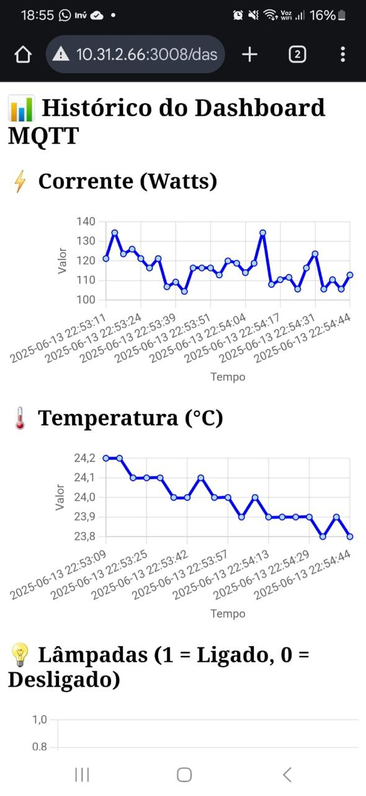

# Servidor_digitalTwins
 
# 🚀 Guia de Configuração do Servidor Node.js com Dashboard MQTT

Este guia descreve o passo a passo para configurar, rodar e acessar o servidor Node.js responsável pela coleta de dados de sensores e controle remoto via dashboard web.

---

## 📁 Estrutura de Pastas

```
supervisorio_mqtt_dashboard/
├── config/
│   └── sequelize.js
├── models/
│   └── topico.js
├── public/
│   ├── css/
│   │   └── style.css
│   └── js/
│       └── dashboard.js
├── routes/
│   └── api.js
├── views/
│   ├── layouts/
│   │   └── main.handlebars
│   └── index.handlebars
├── index.js
└── package.json
```
## 🛠 Requisitos

- Node.js instalado (https://nodejs.org)
- Acesso à internet para instalar pacotes

---

## 📦 Instalação dos Pacotes

No terminal, dentro da pasta do projeto, execute:

```bash
npm install express express-handlebars body-parser mqtt sequelize sqlite3
```

---

## 🔗 Configuração do Banco de Dados

- Por padrão, o sistema utiliza **Postgre** local.
- O arquivo do banco será gerado automaticamente: `mqtt_db.sqlite`

Se desejar usar outro banco (MySQL, SQLSERVER), edite `config/sequelize.js`.
- 

---

## 🚀 Iniciar o Servidor

```bash
node index.js
```

- Acesse no navegador:
```
http://localhost:3008/dashboard
```

Ou via IP local para acesso remoto:
```
http://192.168.X.X:3008/dashboard
http://localhost:3008/dashboard
```

---

## 🌐 Dashboard Web

- O dashboard permite visualizar dados de sensores de **temperatura** e **corrente** em tempo real.
- Controle remoto pode ser adicionado através de botões ou comandos MQTT.
- 
  

---

## 📡 Conexão com MQTT

- O servidor se conecta automaticamente ao broker MQTT configurado em:

```
index.js ➔ mqtt.connect('mqtt://localhost')
```

Altere conforme necessário para o endereço do seu broker.


## 📢 Observações

- Certifique-se de que o broker MQTT está ativo na rede.
- Sensores devem estar enviando dados MQTT corretamente.
- Porta 3008 deve estar liberada para acesso remoto na sua rede.

---

👍 Se precisar de ajuda, chame!
